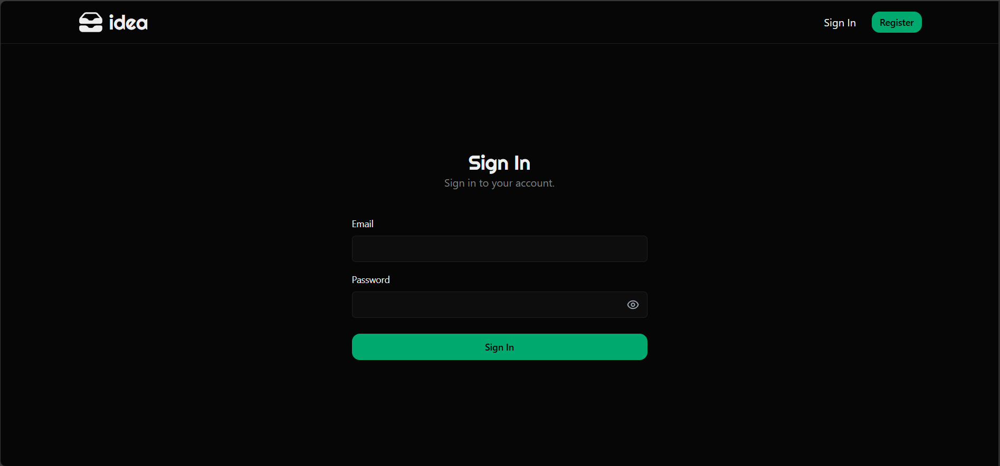
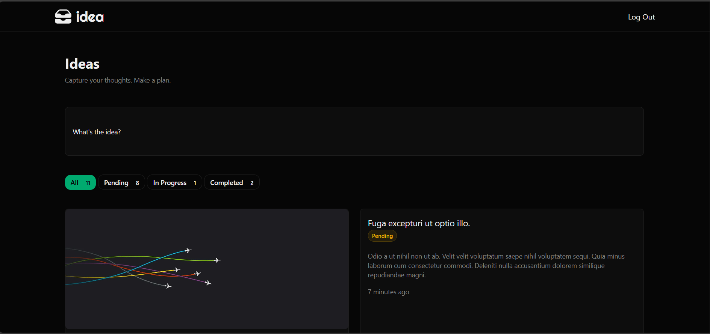
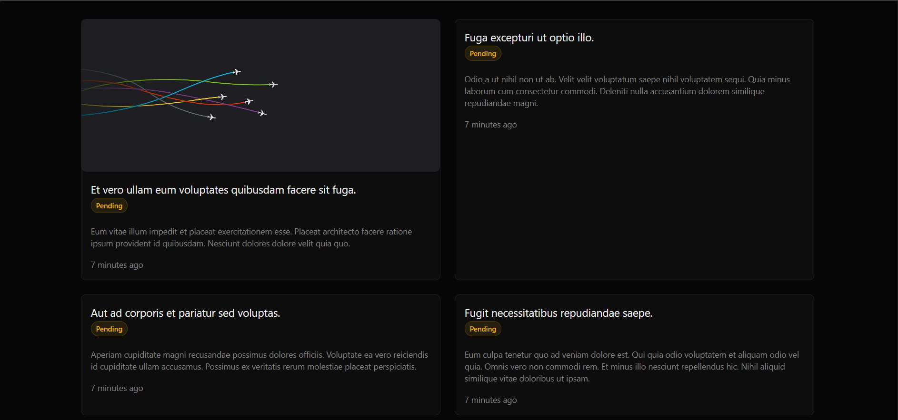
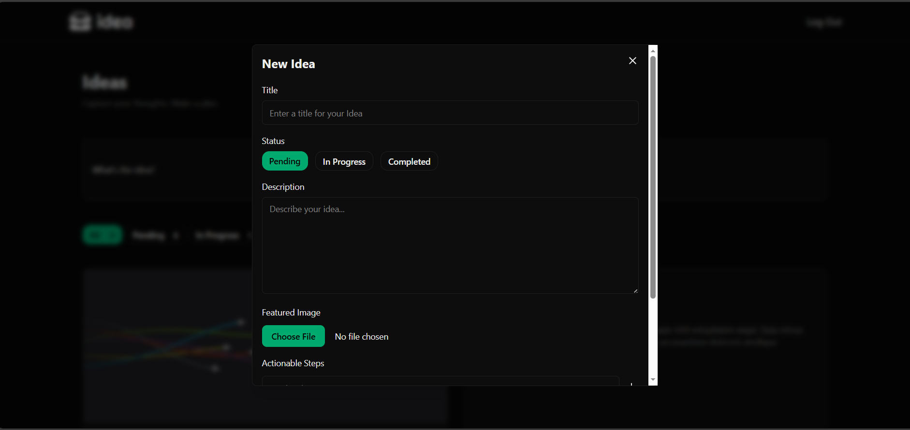
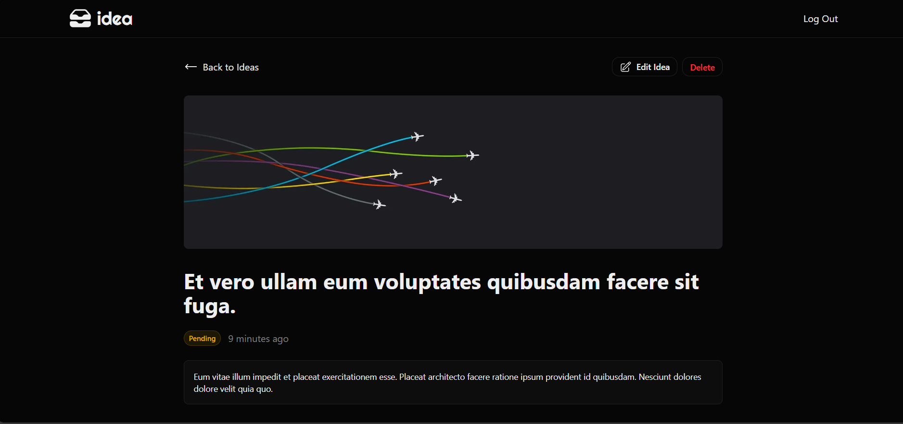
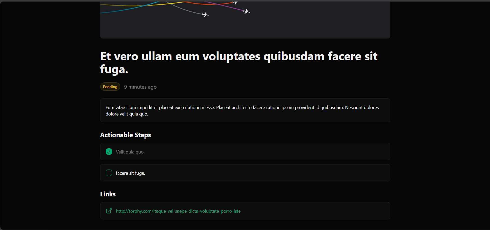

# Ideas

Ideas is a sleek and modern platform designed to help you capture, organize, and track your creative projects from conception to completion.

## Features

- **Idea Management**: Easily create, update, and manage your ideas in one central place.
- **Markdown Support**: Rich text descriptions with full Markdown support, powered by Tailwind CSS Typography.
- **Status Tracking**: Monitor your progress with statuses like `Pending`, `In Progress`, and `Completed`.
- **Modern UI**: A clean, responsive interface built with Tailwind CSS, featuring dark mode support and smooth transitions.
- **Robust Testing**: A comprehensive test suite powered by **Pest PHP** ensuring application stability.
- **Code Quality**: Maintained with **Rector** and **Laravel Pint** for consistent, modern PHP standards.

## Getting Started

### Prerequisites

- PHP ^8.2
- Composer
- Node.js & NPM

### Installation

The project includes a convenient setup script that handles dependency installation, environment configuration, and database migrations.

```bash
# Clone the repository
git clone https://github.com/callmeaash/ideas.git
cd ideas

# Install dependencies
composer install

# Create and configure .env file
cp .env.example .env

# Run migrations
php artisan migrate

# Install and build frontend dependencies
npm install
npm run build

## Testing

We use [Pest PHP](https://pestphp.com/) for our testing suite. Run the tests using the following command:

```bash
composer run pest
```

## Tech Stack

- **Framework**: [Laravel 12](https://laravel.com)
- **Frontend**: [Tailwind CSS](https://tailwindcss.com) with Typography plugin
- **Testing**: [Pest PHP](https://pestphp.com)
- **Static Analysis**: [Rector](https://getrector.com)
- **Formatting**: [Laravel Pint](https://laravel.com/docs/11.x/pint)

## Screenshots











